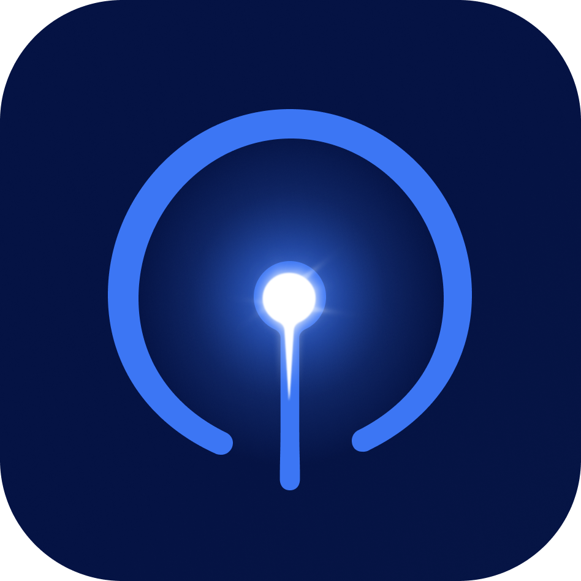
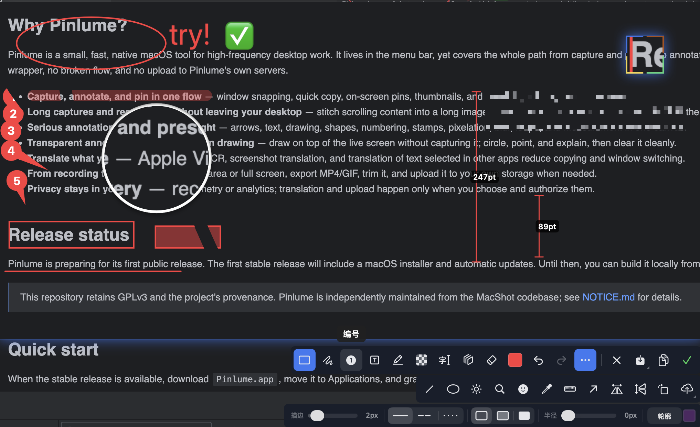

# Pinlume

<p align="center">
  
</p>
<p align="center">
  <b>A native macOS tool for capture, pinning, annotation, OCR, translation, and recording.</b><br>
</p>

<p align="center">
  <a href="./README.zh-CN.md">简体中文</a> · <a href="https://github.com/pinlume">GitHub Organization</a> · <a href="./PRIVACY.md">Privacy</a> · <a href="./NOTICE.md">Attribution</a> · <a href="./LICENSE">GPLv3</a>
</p>

<p align="center">
  
</p>

---

## Why Pinlume?

Pinlume is a small, fast, native macOS tool for high-frequency desktop work. It lives in the menu bar, yet covers the whole path from capture and pinning to annotation, OCR, translation, and recording. No web wrapper, no broken flow, and no upload to Pinlume's own servers.

- **Capture, annotate, and pin in one flow** — window snapping, quick copy, on-screen pins, thumbnails, and re-editing all stay on your screen.
- **Long captures and recordings without leaving your desktop** — stitch scrolling content into a long image; record an area or the full screen to MP4/GIF, then trim and export.
- **Serious annotation that stays lightweight** — arrows, text, drawing, shapes, numbering, stamps, pixelation, blur, loupe, and measurement in one canvas.
- **Transparent annotation and presentation drawing** — draw on top of the live screen without capturing it; circle, point, and explain, then clear it cleanly.
- **Translate what you see** — Apple Vision OCR, screenshot translation, and translation of text selected in other apps reduce copying and window switching.
- **From recording to delivery** — record an area or full screen, export MP4/GIF, trim it, and upload it to your own storage when needed.
- **Privacy stays in your hands** — no telemetry or analytics; translation and upload happen only when you choose and authorize them.

## Release status

Pinlume is preparing for its first public release. The first stable release will include a macOS installer and automatic updates. Until then, you can build it locally from source.

> This repository retains GPLv3 and the project's provenance. Pinlume is independently maintained from the MacShot codebase; see [NOTICE.md](NOTICE.md) for details.

## Quick start

When the stable release is available, download `Pinlume.app`, move it to Applications, and grant the permissions macOS requests on first use.

1. Launch Pinlume.
2. Press `Command + F1` to start a capture.
3. Select an area, annotate with the toolbar, press `Command + C` to copy, or press `F3` to pin from the clipboard. Shift-double-click shrinks a pin; double-click closes it.
4. Press `Option + 2` to translate selected text, `Option + F` for screenshot translation, or `Option + Shift + F` for selectable-text capture.
5. Press `Esc` to cancel the current action or close a popover.

### Build from source

Requires macOS 12.3 or later and Xcode.

```bash
# Build the fixed-identity Debug app only
scripts/build-pinlume.sh

# Build and launch the Debug app
scripts/run-pinlume.sh

# Install a local build in /Applications for staged testing
scripts/install-pinlume.sh
```

Local builds use the `Pinlume` name, Bundle ID `com.pinlume.app`, and URL scheme `pinlume://`. Their signature is for stable local permissions and testing, not a notarized release package.

<details>
<summary><b>Full feature set</b></summary>

### Capture and pins

- **Instant capture and window snapping** — enter selection with a global shortcut; snap to a window or capture the full screen.
- **Selection control** — set an exact pixel size or common aspect ratio; edges can snap while you drag.
- **Quick capture** — Enter and Quick Capture can copy, save, or pin according to your settings.
- **Scroll capture and delayed capture** — stitch vertical or horizontal scrolling content, or start after a countdown.
- **Pin to screen** — turn a selection or clipboard image into a floating pin; move, resize, compact, re-edit, or close it.
- **Transparent annotation** — keep arrows, text, stamps, and other annotations on screen as a transparent pin without capturing desktop content.
- **Presentation drawing** — draw and point directly on the live screen, then undo or end the session without creating an image file.

### Annotation and editing

- **Arrows, lines, and shapes** — multiple arrow styles, rectangles, ellipses, fills, rounded corners, and rotation.
- **Text, drawing, and numbering** — rich text, pencil, marker, and auto-incrementing numbers.
- **Stamps** — built-in emoji or any imported image, with proportional scaling and rotation.
- **Redaction and privacy** — pixelation, blur, and solid fills; detect common sensitive text such as email, phone numbers, card numbers, and API keys, with optional face, person, or all-text redaction.
- **Supporting tools** — measurement, loupe, spotlight, color sampling, alignment guides, undo, and redo.
- **Standalone editor** — continue annotating, crop, flip, zoom, paste images, and add fresh captures.

### OCR and translation

- **OCR** — extract text from a capture with Apple Vision and copy the result.
- **Screenshot translation** — recognize text in an image and translate it to the language you choose.
- **Selected-text translation** — when enabled in Settings, translate the current selection from another app; macOS accessibility permission is requested when needed.
- **QR codes and AI search** — recognize QR codes, copy or open their contents, and send recognized content to Google AI Search.
- **Privacy and network choices** — online translation, Google AI Search, and uploads connect only after you choose them. Google services require a network that can reach them.

### Who is it for?

- **Developers, designers, and serious vibe coders.**
- **People who communicate and write docs often** — capture, annotate, and pin the important part quickly.
- **People collaborating on a computer** — use arrows, transparent annotations, and presentation drawing to explain a screen, diagnose a problem, or record feedback.
- **People reading material in other languages** — use screenshot OCR or selected-text translation with less copying and switching.
- **People recording tutorials or reproductions** — record, trim, and export in one native app.

### Screen recording

- Record an area or the full screen to MP4 or GIF.
- Choose system audio, microphone audio, and mouse-click highlighting.
- The built-in video editor supports trimming, playback, muting, saving, and exporting.

### Output, history, and upload

- **Formats** — PNG, JPEG, HEIC, WebP, and AVIF, with quality and Retina downscaling controls.
- **History** — keep recent captures and reopen, copy, save, pin, or edit them.
- **Optional upload** — Google Drive, imgbb, and S3-compatible storage; images or videos leave your device only when you enable and run an upload.
- **Beautify** — add backgrounds, window frames, shadows, and gradients.

</details>

<details>
<summary><b>Keyboard shortcuts</b></summary>

### Built-in profile defaults

| Shortcut | Action |
| --- | --- |
| `Command + F1` | Capture |
| `F3` | Pin from Clipboard |
| `Shift + F3` | Show / Hide All Pins |
| `Option + 2` | Translate Selected Text |
| `Option + F` | Screenshot Translation |
| `Option + Shift + F` | Selectable-text Capture |
| `Command + Option + .` | Transparent Annotation |
| `Command + Option + ,` | Presentation Drawing |
| `Command + Shift + S` | Quick Capture |

**Every shortcut can be changed in Settings → Shortcuts.**

### During capture

| Shortcut | Action |
| --- | --- |
| `Enter` | Run the default output action |
| `Command + C` | Copy to Clipboard |
| `Command + S` | Save to File |
| `Command + Z` / `Command + Shift + Z` | Undo / Redo |
| `Esc` | Cancel / Close popover |
| `Delete` | Delete the selected annotation |
| `Tab` | Toggle window snapping |
| `F` | Capture the full screen in window-snap mode |
| Hold `Option` | Temporarily show the pixel magnifier at the pointer |
| Hold `Shift` + double-click a pin | Toggle between the pin and its thumbnail |
| `Shift` while drawing | Constrain a line or shape |
| `Space` while drawing | Move the shape being drawn |

</details>

## Permissions and privacy

Pinlume explains and requests each permission when its feature first needs it:

- **Screen Recording** — required for capture, window snapping, scroll capture, and recording.
- **Accessibility** — used only after you enable selected-text translation, to read the current selection in another app.
- **Microphone** — requested only when you choose to record microphone audio.

Pinlume collects no telemetry, analytics, or crash reports by default. Captures, recordings, history, settings, and diagnostics remain on your device. See [PRIVACY.md](PRIVACY.md) for the boundary around optional upload and online translation.

## Requirements

macOS 12.3 (Monterey) or later. Some OCR, translation, and visual features depend on the macOS version and system frameworks available on your Mac.

## Contributing

Issues and pull requests are welcome. See [CONTRIBUTING.md](CONTRIBUTING.md) for build, test, and contribution expectations.

## License and attribution

Pinlume is licensed under [GPLv3](LICENSE). Original contributions, historical commits, and third-party attribution retain their actual provenance; see [NOTICE.md](NOTICE.md).
